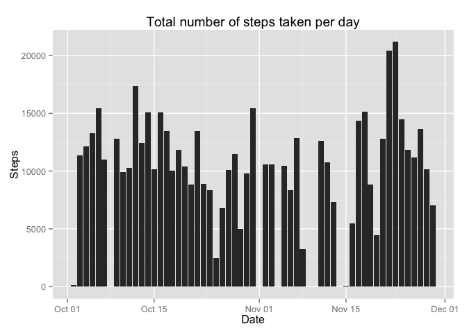
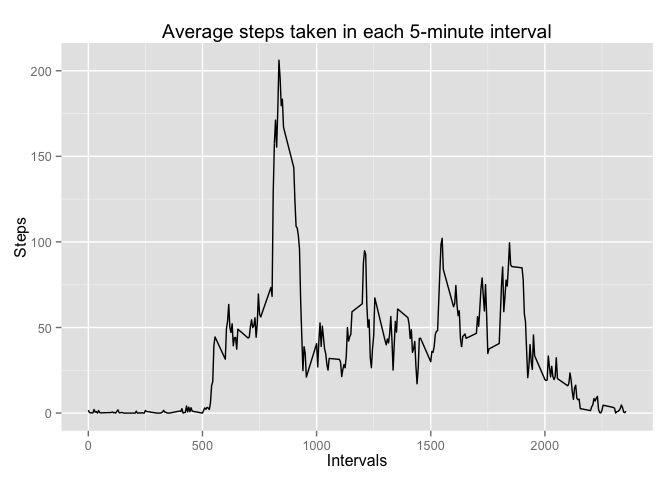
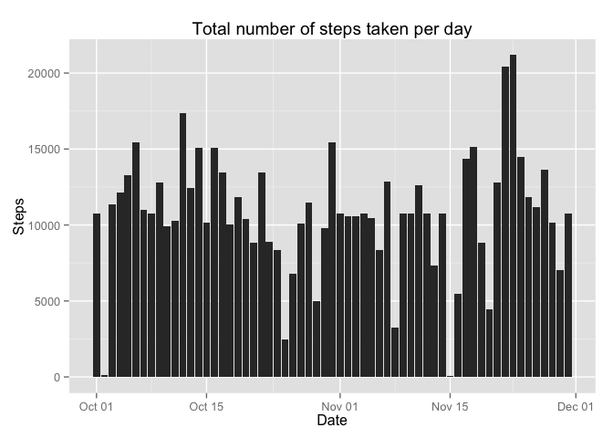
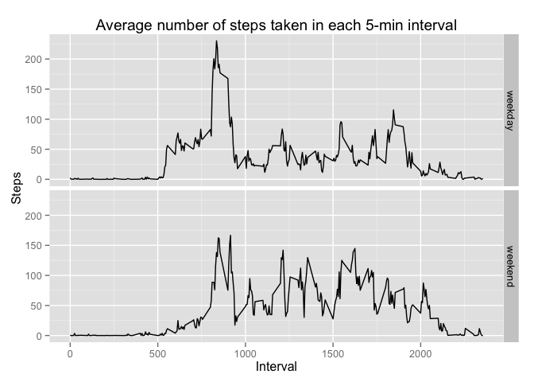

# Peer Assessment 1


## Loading and preprocessing the data

```r
if (file.exists("activity.csv")) {
        download.file("http://d396qusza40orc.cloudfront.net/repdata%2Fdata%2Factivity.zip", destfile = "repdata-data-activity.zip")
        unzip("repdata-data-activity.zip")
}

data <- read.csv("activity.csv")
```


## What is mean total number of steps taken per day?

- Calculate the total number steps taken per day by function `aggregate` and plot the histogram by `ggplot`.

```r
totalStepsPerDay <- aggregate(data$steps, list(date = data$date), sum)
colnames(totalStepsPerDay) <- c("date", "steps")
library(ggplot2)
ggplot(totalStepsPerDay, aes(x = as.Date(date), y = steps)) + geom_histogram(stat = "identity") + labs(title = "Total number of steps taken per day", x = "Date", y = "Steps")
```

 

- The `mean` total number of steps taken per day is

```r
mean(totalStepsPerDay$steps, na.rm = T)
```

```
## [1] 10766.19
```

- The `median` total number of steps taken per day is

```r
median(totalStepsPerDay$steps, na.rm = T)
```

```
## [1] 10765
```

## What is the average daily activity pattern?

- Make a time series plot (i.e. `type = "l"`) of the 5-minute interval (x-axis) and the average number of steps taken, averaged across all days (y-axis)

```r
aveSteps <- aggregate(data$steps, list(interval = data$interval), mean, na.rm = T)
colnames(aveSteps) <- c("interval", "steps")
ggplot(aveSteps, aes(x = interval, y = steps)) + geom_line() + labs(title = "Average steps taken in each 5-minute interval", x = "Intervals", y = "Steps")
```

 

- Which 5-minute interval, on average across all the days in the dataset, contains the maximum number of steps?

```r
index <- which.max(aveSteps$steps)
aveSteps[index,]
```

```
##     interval    steps
## 104      835 206.1698
```


## Imputing missing values
- Calculate and report the total number of missing values in the dataset (i.e. the total number of rows with `NA`s)

```r
sum(is.na(data$steps))
```

```
## [1] 2304
```

- Devise a strategy for filling in all of the missing values in the dataset: missing data is filled with average steps taken in that particular interval. The imputed data set is assigned to `dataImputed`.

```r
dataImputed <- data
for (i in 1:nrow(dataImputed)) {
        if (is.na(dataImputed[i, 1])) {
                dataImputed[i, 1] <- aveSteps[aveSteps$interval == dataImputed[i, 3], 2]
        }
                
}
```

- Make a histogram of the total number of steps taken each day and Calculate and report the mean and median total number of steps taken per day. Do these values differ from the estimates from the first part of the assignment? What is the impact of imputing missing data on the estimates of the total daily number of steps?

```r
totalStepsPerDayImputed <- aggregate(dataImputed$steps, list(date = dataImputed$date), sum)
colnames(totalStepsPerDayImputed) <- c("date", "steps")
ggplot(totalStepsPerDayImputed, aes(x = as.Date(date), y = steps)) + geom_histogram(stat = "identity") + labs(title = "Total number of steps taken per day", x = "Date", y = "Steps")
```

 

The `mean` and `median` total number of steps taken per day are:

```r
mean(totalStepsPerDayImputed$steps)
```

```
## [1] 10766.19
```

```r
median(totalStepsPerDayImputed$steps)
```

```
## [1] 10766.19
```

Compared to the `mean` and `median` values above, they are very similar.


## Are there differences in activity patterns between weekdays and weekends?

- Create a new factor variable in the dataset with two levels - "weekday" and "weekend" indicating whether a given date is a weekday or weekend day


```r
days <- weekdays(as.Date(dataImputed$date))
dataImputed$weekday <- "weekday"
for (i in 1:nrow(dataImputed)) {
        if (days[i] %in% c("Saturday", "Sunday"))
                dataImputed[i, ]$weekday <- "weekend"
}
dataImputed$weekday <- factor(dataImputed$weekday)

str(dataImputed)
```

```
## 'data.frame':	17568 obs. of  4 variables:
##  $ steps   : num  1.717 0.3396 0.1321 0.1509 0.0755 ...
##  $ date    : Factor w/ 61 levels "2012-10-01","2012-10-02",..: 1 1 1 1 1 1 1 1 1 1 ...
##  $ interval: int  0 5 10 15 20 25 30 35 40 45 ...
##  $ weekday : Factor w/ 2 levels "weekday","weekend": 1 1 1 1 1 1 1 1 1 1 ...
```

- Make a panel plot containing a time series plot (i.e. `type = "l"`) of the 5-minute interval (x-axis) and the average number of steps taken, averaged across all weekday days or weekend days (y-axis).


```r
aveStepsPerDay <- aggregate(dataImputed$steps, list(interval = dataImputed$interval, weekday = dataImputed$weekday), mean)
colnames(aveStepsPerDay) <- c("interval", "weekday", "steps")
ggplot(aveStepsPerDay, aes(x = interval, y = steps)) + geom_line() + facet_grid(weekday ~ .) + labs(title = "Average number of steps taken in each 5-min interval", x = "Interval", y = "Steps")
```

 


